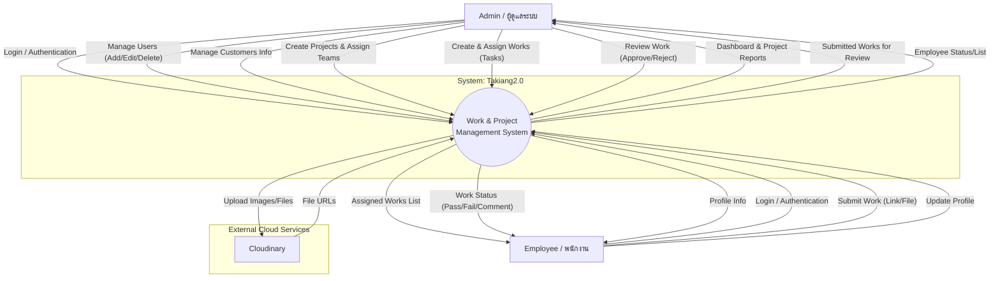

# System Context Diagram: Takiang2.0 (V2Task)

This document outlines the Context Diagram (DFD Level 0) for the Takiang2.0 system. The system is designed to manage projects, tasks (works), and employee assignments for a printing/design business.

## 1. Actors (External Entities)

The system interacts with two primary actors:

1.  **Admin (ผู้ดูแลระบบ):** 
    -   Has full control over the system.
    -   Manages users, customers, projects, and work assignments.
    -   Reviews and approves submitted works.
2.  **Employee (พนักงาน/ผู้ใช้งาน):** 
    -   Operational users who perform the assigned tasks.
    -   Receives work assignments, tracks status, and submits completed work.
3.  **Cloudinary (External System):**
    -   Third-party service used for storing media files (images/files) uploaded by users.

---

## 2. Context Diagram (Mermaid)

---

## 3. Data Flow Descriptions

### Admin Flows
*   **Inputs to System:**
    *   **User Management:** Admin inputs username, password, team, and employee ID to create new accounts.
    *   **Customer Management:** Admin inputs customer details (Name, Address, Tax ID) for billing and project association.
    *   **Project Creation:** Admin defines new projects (Project Name, Customer, Price, Deadline).
    *   **Work Assignment:** Admin breaks down projects into works (tasks), defining type, description, and assigning to specific employees.
    *   **Work Checking:** Admin sends "Pass" or "Fail" status and comments back to the system after reviewing works.

*   **Outputs from System:**
    *   **Dashboard:** Aggregated view of project statuses, earnings, and team performance.
    *   **Work Notifications:** Alerts or lists showing works waiting for review (Submitted status).

### Employee Flows
*   **Inputs to System:**
    *   **Authentication:** Username and password for access.
    *   **Work Submission:** Links or files proving work completion, along with the "Round Number" of submission.
*   **Outputs from System:**
    *   **My Works:** A filtered list of tasks assigned specifically to the logged-in employee, sorted by due date or status.
    *   **Review Feedback:** Comments and status updates (e.g., if a job is rejected, the employee sees the feedback to fix it).

---

## 4. Key Data Stores (Internal)
*While not typically shown in a Context Diagram, these support the flows above:*
*   **Users Table:** Stores credentials and team info.
*   **Customers Table:** Stores client information.
*   **Projects Table:** Stores high-level project goals and status.
*   **Works Table:** Stores individual task details linking Projects to Employees.
*   **Submitted Works Table:** Tracks history of submissions and reviews.
