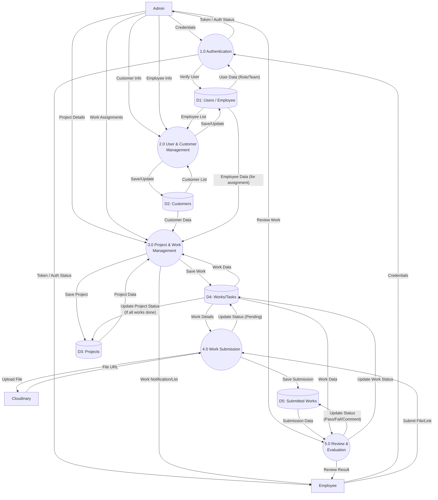

# Data Flow Diagram (DFD) Level 1: Takiang2.0

This document details the **Level 1 Data Flow Diagram**, expanding on the Context Diagram to show the internal sub-processes and data stores of the Takiang2.0 system.

## 1. DFD Level 1 (Mermaid)

---

## 2. Process Descriptions

### 1.0 Authentication (Login & Access Control)
*   **Input:** Username/Password from Admin or Employee.
*   **Process:** Verifies credentials against `D1: Users`. Determines user role (Admin/Employee) and Team.
*   **Output:** Access Token / Dashboard Redirect.

### 2.0 User & Customer Management
*   **Input:** New user data, customer details, updates to profiles.
*   **Process:** CRUD operations for Users and Customers.
*   **Output:** Confirmed updates in `D1: Users` and `D2: Customers`.

### 3.0 Project & Work Management
*   **Input:** Project specifications, prices, deadlines, work breakdown.
*   **Process:** 
    *   Creates new Project records in `D3`.
    *   Creates Work records in `D4` linked to Projects.
    *   Assigns Works to specific Employees (from `D1`).
*   **Output:** Assigned tasks visible to employees.

### 4.0 Work Submission (Execution)
*   **Input:** Work links, files, completion confirmation from Employee.
*   **Process:** 
    *   Uploads physical files to Cloudinary (External).
    *   Records submission timestamp and link in `D5: Submitted Works`.
    *   Updates Work status to "Pending Review" in `D4`.
*   **Output:** Submission record.

### 5.0 Review & Evaluation
*   **Input:** Admin review decision (Pass/Fail) and comments.
*   **Process:** 
    *   Admin checks `D5: Submitted Works`.
    *   Updates status in `D5` and `D4`.
    *   If "Pass", checks if all works in the project are done to update Project status in `D3`.
    *   If "Fail", sends feedback to Employee for re-submission.
*   **Output:** Finalized status, History log.

## 3. Data Dictionary (Key Tables)

| Data Store | Database Table | Key Attributes |
| :-- | :-- | :-- |
| **D1: Users** | `user_login_work` `employee` | `user_id`, `username`, `password`, `team`, `employee_id` |
| **D2: Customers** | `customers` | `customer_id`, `customer_name`, `phone`, `tax_id` |
| **D3: Projects** | `projects` | `project_id`, `project_name`, `price`, `status`, `due_date` |
| **D4: Works** | `works` | `work_id`, `works_name`, `status`, `assigned_to`, `project_id` |
| **D5: Submitted Works** | `submitted_works` | `submitted_id`, `round_number`, `link`, `status`, `reviewer_comment` |
