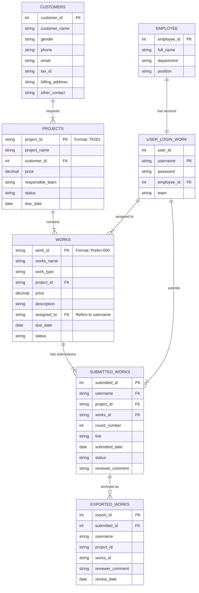

# Entity Relationship Diagram (ERD): Takiang2.0

This document illustrates the **Entity Relationship Diagram (ERD)** for the Takiang2.0 system, detailing the database schema, table structures, and relationships between data entities.

## 1. ER Diagram (Mermaid)

---

## 2. Table Descriptions

### 2.1 Master Data (Users & Customers)

*   **EMPLOYEE (`employee`)**: Stores personal information of the staff.
    *   `employee_id`: Unique identifier (Primary Key).
*   **USER_LOGIN_WORK (`user_login_work`)**: Authentication data linked to an employee.
    *   `username`: Unique login ID (Primary Key/Unique).
    *   `employee_id`: Link to the Employee table.
    *   `team`: The team the user belongs to (admin, graphic, etc.).
*   **CUSTOMERS (`customers`)**: Client information.
    *   `customer_id`: Unique identifier (Auto-increment PK).

### 2.2 Project & Task Management

*   **PROJECTS (`projects`)**: The main order or project requested by a customer.
    *   `project_id`: Custom formatted ID (e.g., TK001).
    *   `customer_id`: Links to the Customer who owns the project.
*   **WORKS (`works`)**: Individual tasks broken down from a project.
    *   `work_id`: Custom formatted ID based on work type (e.g., AL001, CNC001).
    *   `project_id`: Links to the parent Project.
    *   `assigned_to`: Stores the `username` of the employee responsible.

### 2.3 Operations & Logging

*   **SUBMITTED_WORKS (`submitted_works`)**: Records of work submissions by employees.
    *   `round_number`: Tracks revision rounds (1st submission, 2nd correction, etc.).
    *   `status`: Status of the specific submission (Pending, Pass, Fail).
*   **EXPORTED_WORKS (`exported_works`)**: A history/archive table for completed or approved works, often used for reporting or final records.

---

## 3. Key Relationships

1.  **One Employee has One Account:** `EMPLOYEE` is linked 1:1 with `USER_LOGIN_WORK`.
2.  **One Customer has Many Projects:** A `CUSTOMER` can order multiple `PROJECTS`.
3.  **One Project has Many Works:** A `PROJECT` is composed of multiple `WORKS` (Tasks).
4.  **One User (Employee) has Many Assigned Works:** `USER_LOGIN_WORK` (via username) is assigned to multiple `WORKS`.
5.  **One Work has Many Submissions:** `WORKS` can have multiple entries in `SUBMITTED_WORKS` (due to revisions/rounds).
